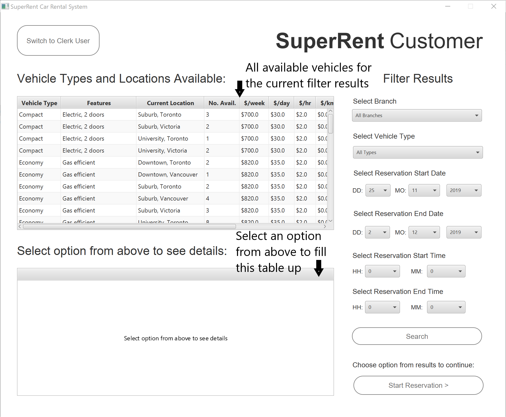

# CPSC304-SuperRent-Car-Rental-System

A cloud-connected rental car management system

Download the desktop application:  [Windows Executable]()   |   [JAR File]()  (Mac/Windows)     # TODO: Add links to .exe and .jar

> NOTE! You need an internet connection to use this application since the database is hosted in the cloud.

In this README:

* [Run the application](#run-the-application)
    * Using the Windows Executable
    * Using the JAR file (requires Java 8)
    * In IntelliJ IDE (requires Maven plugin)

* [Where to find in the code:](#where-to-find-in-the-code)
    * [All the SQL queries](./src/main/java/model/Queries.java) 
    * [Establishing connection to DB and JDBC calls](./src/main/java/model/Database.java)
    * [UI Components.](./src/main/java/gui) We used JavaFx, the fxml files are in [views](./src/main/java/gui/views), 
    while the UI components are in [controllers](./src/main/java/gui/controllers).

* [How to use the application:](#how-to-use-the-application)

    // TODO: Attach wireframe here if time permits

    * Customer:
        * View the number of available cars for a given car type/location/time
        * See details of the specific cars for a given car type/location
        * Make a reservation
    * Clerk/Staff:
        * Switch to the Clerk view
        * View active rentals and reservations and filter by confirmation number and customer
        * Start a rental for an active reservation
        * Create a return for an active rental
        * View Daily Reports:
            * View Daily Reports for Rentals:
                * For all locations
                * For a specific location
            * View Daily Reports for Returns:
                * For all locations
                * For a specific location
    * Errors and troubleshooting:
        * What happens if I put an invalid value?
        * Database connection error
## Run the application

## Where to find in the code

## How to use the application
#### Customer:
* View the number of available cars for a given car type/location/time:
You must indicate the time period that you are interested in, and then you can use the drop down lists to refine the search
results. You can choose a specific car type, and a location.

After choosing the car, the customer clicks on Start Reservation, and then they are moved to the next window where they can enter their info
 