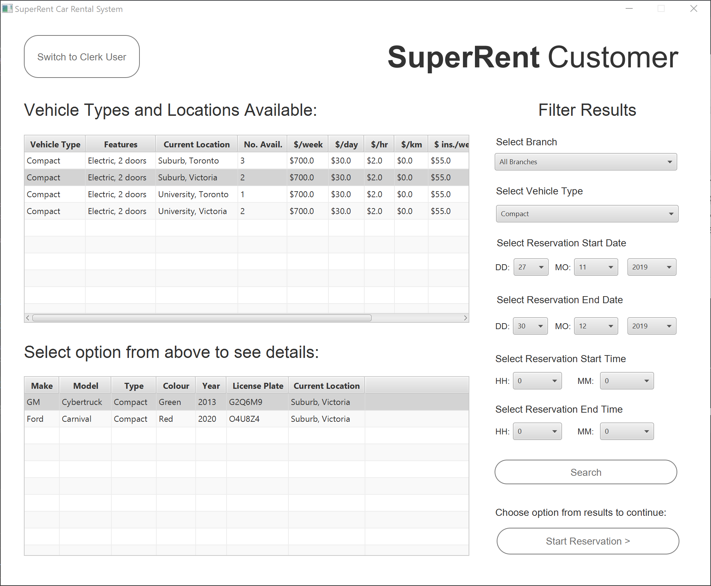

# CPSC304-SuperRent-Car-Rental-System

A cloud-connected rental car management system

Download the desktop application:  [Windows Executable / JAR File]()  (Windows/Mac)     # TODO: Add links to .exe and .jar

> NOTE! You need an internet connection to use this application since the database is hosted on the cloud.

> NOTE! Minimum screen resolution is 1000x800.

In this README:
* [Run the application](#run-the-application)
    * [Using the Windows Executable](#windows)
    * [Using the JAR file (requires Java 8)](#jar)
    * [In IntelliJ IDE (requires Maven plugin)](#intellij)

* [Where to find in the code:](#where-to-find-in-the-code)
    * [All the SQL queries](#all-the-sql-queries) 
    * [Establishing connection to DB and JDBC calls](#establishing-connection-to-db-and-jdbc-calls)
    * [UI Components.](#ui-components)

* [How to use the application:](#how-to-use-the-application)

    // TODO: Attach wireframe here if time permits

    * [Customer](#customer):
        * [View Reservation Options](#view-reservation-options)
        * [Reservations](#customer-reservations)
    * [Clerk/Staff](#clerk):
        * [Reservations](#clerk-reservations)
        * [Rentals](#rentals)
        * [Returns](#returns)
        * [Reports](#reports)

    * [Errors and troubleshooting](#errors-and-troubleshooting):
        * [What happens if I put an invalid value?](#invalid-values)
        * [Database connection error](#database-connection-error)
        
## Run the application
### Windows:

### JAR:

### IntelliJ:

## Where to find in the code
### All the SQL queries

[Click Here](./src/main/java/model/Queries.java) 

### Establishing connection to DB and JDBC calls

[Click Here](./src/main/java/model/Database.java)

### UI Components

[Click Here.](./src/main/java/gui) We used JavaFx, the fxml files are in [views](./src/main/java/gui/views), while the UI components 
are in [controllers](./src/main/java/gui/controllers).

## How to use the application
### Customer:

#### View Reservation Options
View the number of available cars for a given car type/location/time:
You must indicate the time period that you are interested in, and then you can use the drop down lists to refine the search
results. You can choose a specific car type, and a location.

 

\TODO Change

#### Customer Reservations
After choosing the car, the customer clicks on Start Reservation, and then they are moved to the next window where they can enter their info

I the customer is an existing one, then their fields are auto filled, otherwise, they fill the fields and are added to the system.
You'll also notice that the customer gets back their reservation confirmation number. 

### Clerk:
When the GUI launches, it automatically goes into the Customer view. To change to the Clerk view, you have to on the Clerk View

\TODO Change

 This is the screen that the clerk gets. It is split into a section for the ongoing reservations, which includes every Reservation with an end date in the future,
 and a car that has not been picked up yet. And another section which is ongoing rentals, which includes all the cars that have been rented out but not yet returned.
 
 
 
#### Clerk Reservations
 To start a rental without a reservation , the clerk clicks on Start Rental Without Reservation
 
 
 
This will take them to a Reservation screen similar to the one that the customer would get, except without the choice to
 choose a start time since that would be set to the current time. And once they pick the car type they want to reserve, they will be sent to a new screen to add the 
 information of the customer.
 
 
 
 #### Rentals
If there was an open Reservation that we needed to start, then the clerk can either find it through filtering based on 
the confirmation number, or the drivers license. When the clerk clicks on Start Rental For This Reservation, they are
 Taken to the following screen where they have to add the Credit Card information. 
 
  
  
 Note that the car is chosen at random from the available cars in that branch matching the same data type as the one in the reservation
 
 #### Returns
 After the rental is added, it can be found in the Ongoing Rentals Table. The Clerk can select a Rental Id number to process the return of that car.
 After they choose the number, they are taken to the page where they can process the return transaction and calculate the price of that rental.
 
  
  
#### Reports
To generate Reports, the Clerk has to go to the Clerk view home page and click on view daily reports. From there, 
they can chose to view either rental, or return reports. Which will be returned displayed based on the location or the vehicle type.

### Errors and troubleshooting:

#### Invalid values
The application will reject any invalid values and return a message to prompt you to inter a valid value.
 

#### Database connection error
You need an internet connection to use this application since the database is hosted on the cloud.
